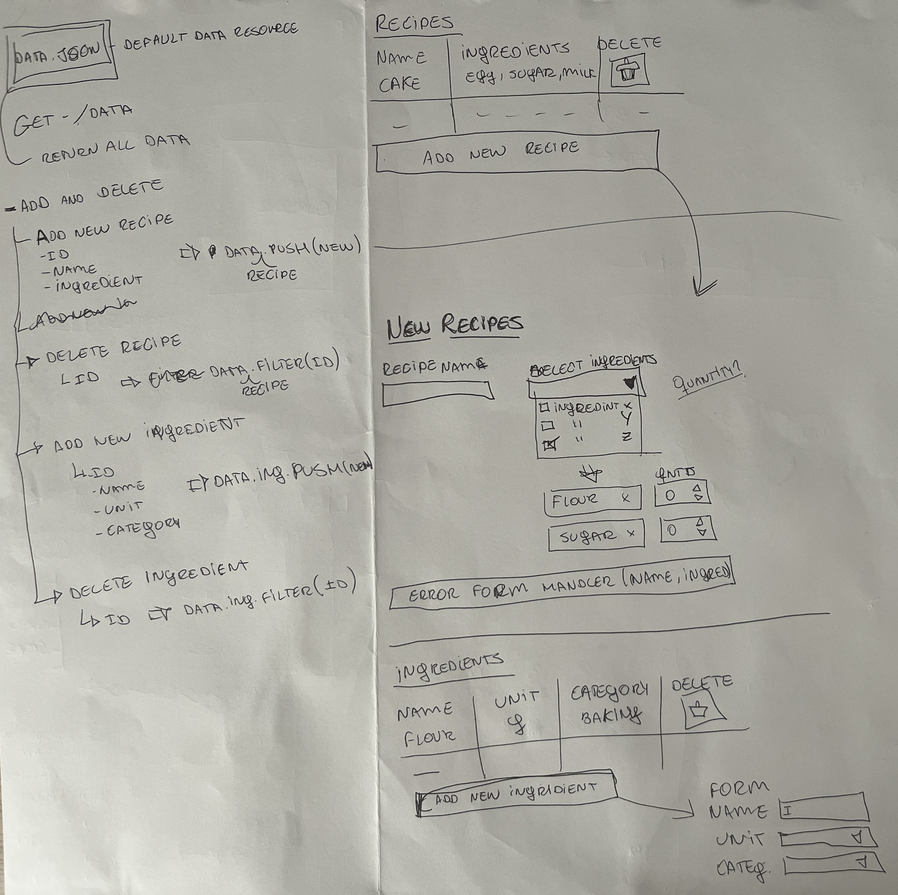
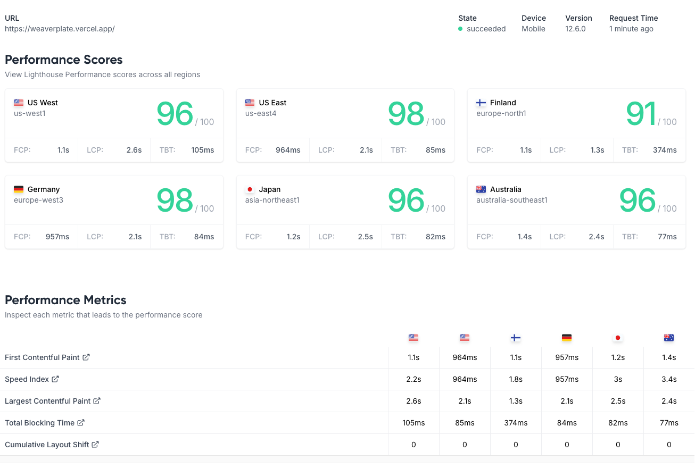
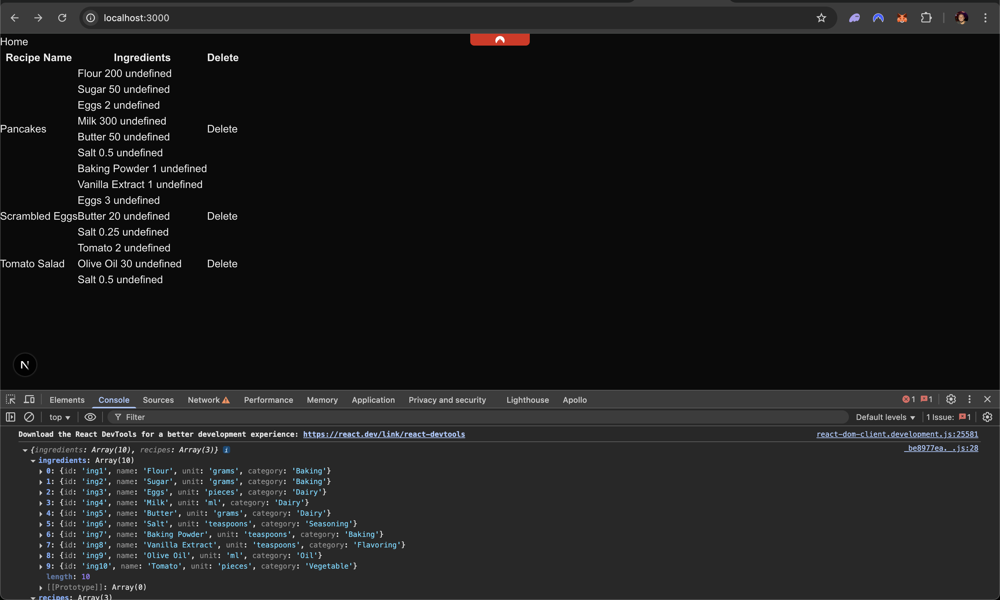
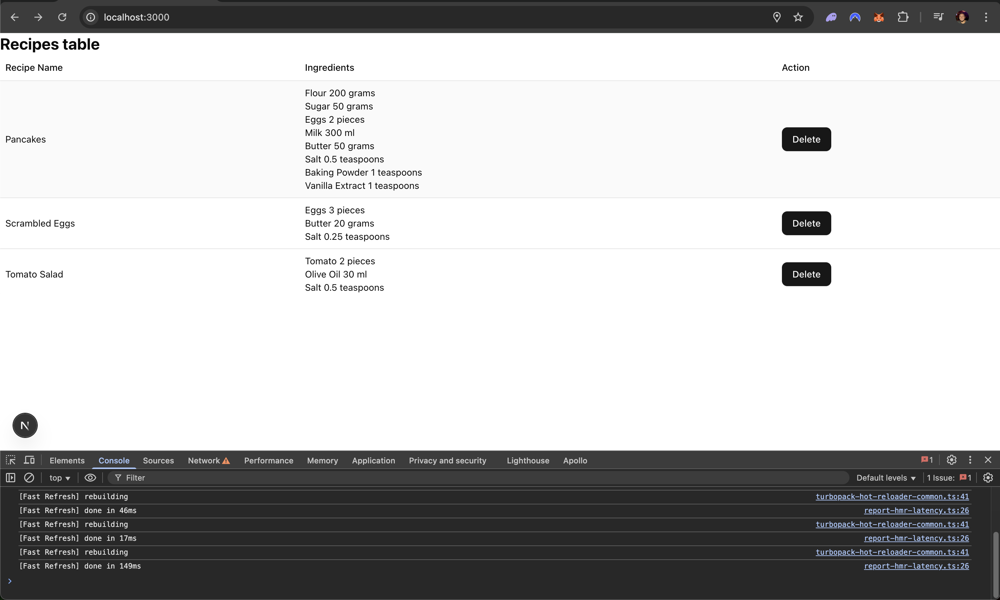
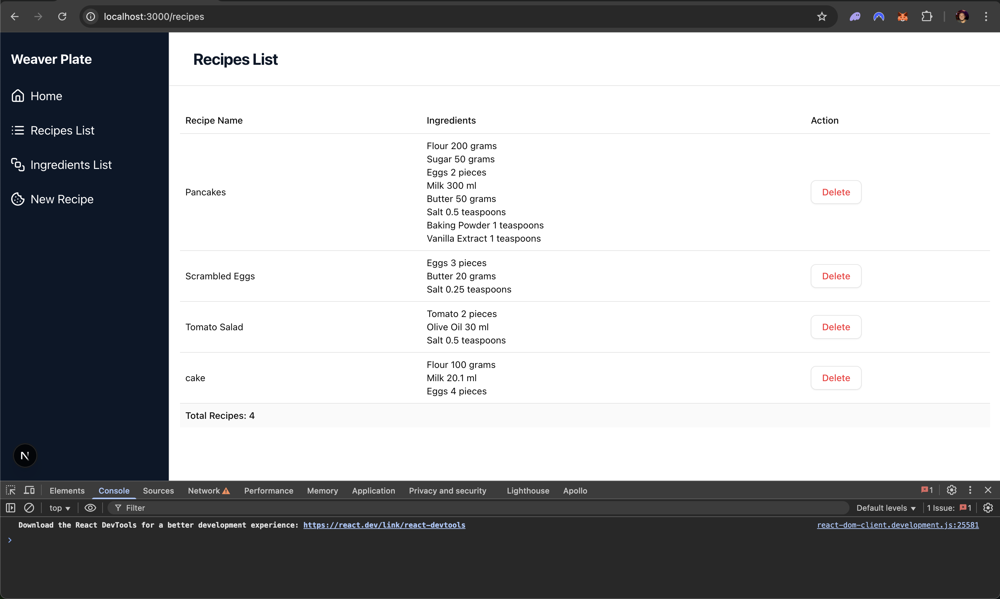
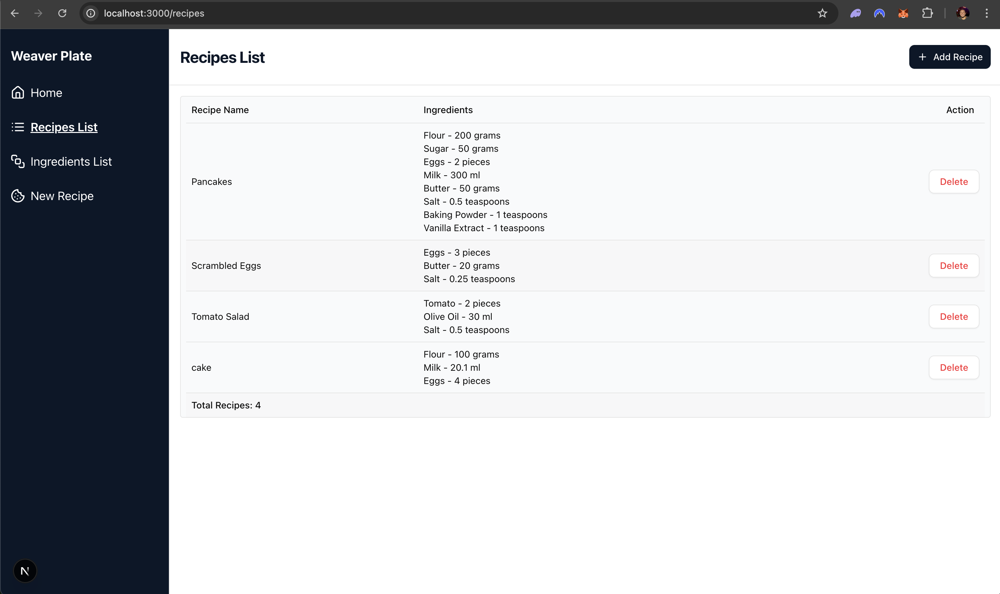
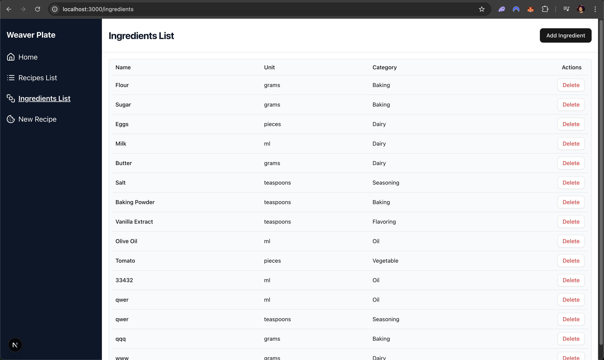
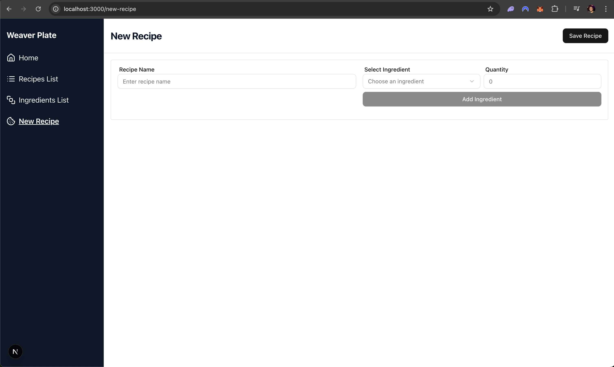

### Live Demo - Deployed on Vercel [weaverplate.vercel.app](https://weaverplate.vercel.app/)

# Development Process

### Steps Taken to Build the Application

The development process started with an analysis of the problem statement and the provided `data.json` file. Once I had a clear understanding, I brainstormed potential solutions, creating quick sketches on paper to visualise the structure and flow of the application:
<br />


With this initial plan, I set up the project using **Next.js**, as it provides a simple way to combine server-side APIs with React. This choice also made it easier to handle backend requests and state management.

I used **Cursor** as an AI assistant to generate boilerplate code and refine components by giving detailed prompts for each screen. I started by implementing the API layer, ensuring that `data.json` acted as a pseudo-database. My primary focus was to preserve its structure, while making minimal adjustments to make it more database-ready for future use.

The first UI feature I developed was the **Recipes Table**, with basic operations like adding and deleting recipes. Once this feature was stable, I implemented the **Ingredients Table**, adding the ability to manage ingredients inline (without navigating to a separate screen), aiming for a simpler user flow. (`Screenshoot of the page progress in the end of this Doc.`)

To improve navigation, I added a **sidebar** with quick links to the pages. I then worked on **form validations** and **deletion safeguards**, such as preventing the removal of an ingredient currently used by a recipe, and adding confirmation modals before delete actions.

Once all core features were implemented, I conducted a thorough review of the codebase, refactoring and simplifying several AI-generated components to improve readability, maintainability, and overall structure.

After the core features were in place, I moved to **testing**:

- **Unit Tests:** Implemented with **Jest** for key functions and components.
- **End-to-End Tests:** Built with **Playwright**, testing flows such as adding, deleting, and verifying empty states. I also adapted the UI for mobile responsiveness since tables are notoriously difficult to handle on smaller screens.

Finally, I deployed the project to **Vercel**.

---

# Challenges

### 1. Choosing the Right State Management

Initially, I considered using **Zustand** for state management. However, I concluded that the problem scope was too small to justify it. Instead, I used:

- **React Query (TanStack Query):** for data fetching, caching, and optimistic updates.
- **React Hook Form + Zod:** to handle form state and validation.
- **Local React state:** for lightweight component state where global management wasn’t needed.

This combination offered simplicity and strong developer experience while avoiding unnecessary complexity.

### 2. Optimistic UI and `data.json` as a Database

Since `data.json` acted as the main data source, I had to ensure updates were immediately reflected in the UI. **React Query’s built-in cache and invalidation** features allowed me to simulate optimistic updates effectively, reducing unnecessary reloads and ensuring a responsive user experience.

### 3. Mobile Responsiveness

Playwright’s mobile test runs revealed some UI inconsistencies, especially with layouts. I applied responsive styling to ensure the UI remained usable across devices.

### 4. File-based Data Storage

Vercel doesn't support server-side file writing for JSON storage. Implemented client-side data management with React Query, easily replaceable with a database

## ✨ Features

### Core Functionality & User Experience

- **Recipe Management**: Create, view, and delete recipes with ingredient lists
- **Ingredient Management**: Add, manage, and track ingredients with categories and units
- **Smart Relationships**: Prevents deletion of ingredients used in recipes
- **Responsive Design**: Optimized for desktop and mobile devices
- **Real-time Validation**: Form validation with immediate feedback
- **Schema-based Validation**: Zod schemas ensure data integrity
- **Intuitive Navigation**: Clean sidebar navigation with mobile optimization
- **Loading States**: Skeleton loaders and loading indicators
- **Success/Error Feedback**: Toast notifications for user actions
- **Confirmation Dialogs**: Safe deletion with confirmation prompts
- **Referential Integrity**: Prevents deletion of ingredients used in recipes

## 🛠️ Tech Stack

### Frontend

- **Next.js** - React framework with App Router and Turbopack
- **TanStack Query (React Query)** - Server state management and caching
- **React Hook Form** - Performant form handling
- **Zod** - Schema validation and type inference
- **Shadcn/ui** - High-quality component library
- **Tailwind CSS** - Utility-first CSS framework

### Testing

- **Jest** - Unit and integration testing
- **Playwright** - End-to-end testing across multiple browsers (Chrome, Firefox, Safari, and mobile browsers)
- **Testing Coverage** - Comprehensive test coverage for business logic and Real-world Scenarios.
- **CRUD Operations**: Create, read, update, delete functionality
- **Navigation Flow**: Complete user journey testing
- **Mobile Responsiveness**: Cross-device compatibility testing
- **Error Handling**: Form validation and error scenarios
- **Business Logic**: Form validation schemas and utility functions
- **Component Tests**: Individual component behavior
- **Hook Tests**: Custom hook functionality

### Project Structure

```
src/
├── app/                 # Next.js App Router pages
├── components/          # Reusable UI components
│   ├── ui/             # Shadcn/ui components
│   └── app-sidebar.tsx # Main navigation component
├── hooks/              # Custom React hooks
├── lib/                # Utilities and constants
└── types.ts            # TypeScript type definitions
```

## 🚀 Getting Started

### Prerequisites

- Node.js 18+
- npm or yarn

### Installation

```bash
# Clone the repository
git clone <repository-url>
cd weaver-labs

# Install dependencies
npm install

# Start development server
npm run dev
```

### Available Scripts

```bash
# Development
npm run dev          # Start development server
npm run build        # Build for production
npm run start        # Start production server

# Testing
npm run test         # Run Jest tests
npm run test:watch   # Run tests in watch mode
npm run test:coverage # Run tests with coverage
npm run test:e2e     # Run Playwright E2E tests
npm run test:e2e:ui  # Run E2E tests with UI

# Code Quality
npm run lint         # Run ESLint
npm run format       # Format code with Prettier
npm run format:check # Check code formatting
```

## 🔮 Improvements

- **Card-based Layout**: Replace tables with modern card components
- **Database Integration**: Replace JSON storage with PostgreSQL or MongoDB
- **User Authentication**: Add user accounts and recipe sharing
- **Advanced Search**: Implement recipe and ingredient search functionality
- **Recipe Categories**: Add categorization and filtering
- **Image Upload**: Allow users to upload recipe images
- **Dark Mode**: Implement theme switching
- **Recipe Ratings**: Add user rating system
- **Print-friendly Views**: Optimize recipe printing

## 📊 Performance Metrics

- **Lighthouse Score**: 95+ across all categories
- **Bundle Size**: Optimized with Next.js built-in optimizations
- **Loading Speed**: Sub-2 second initial load time
- **Mobile Performance**: Optimized for mobile devices
  

## UI Evolution – Development Screenshots







